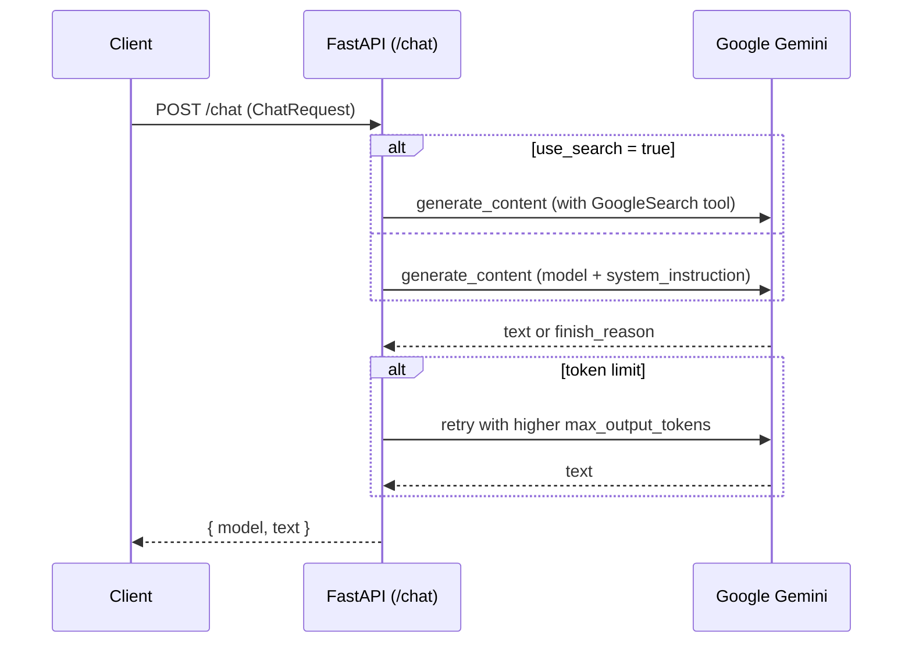

# Backend Architecture: How It Works

This document explains how the FastAPI backend in `backend/` processes chat requests, integrates with Google Gemini, and how the optional API tools module fits in.

- **Entry point**: `backend/main.py`
- **Framework**: FastAPI
- **LLM SDKs**:
  - `google.generativeai` (classic SDK)
  - `google.genai` (newer client) for optional Google Search grounding
- **Primary endpoints**:
  - `GET /health` → health check
  - `POST /chat` → returns `{ model, text }`

## Boot & Configuration

- **Environment loading**: `.env` is loaded via `python-dotenv` if present.
- **Key environment variables** (see `backend/.env.example`):
  - `GOOGLE_API_KEY` (required for `/chat`)
  - `GEMINI_MODEL` (default: `gemini-2.5-flash`)
  - `PORT` (default: `8000`)
  - `ALLOWED_ORIGINS` (CSV; if empty, allow-all for dev)
  - `DEFAULT_MAX_OUTPUT_TOKENS` (default: `2048`)
  - `MAX_OUTPUT_TOKENS_CAP` (default: `8192`)
  - `SYSTEM_PROMPT` or `SYSTEM_PROMPT_PATH` (optional default system instruction)
- **CORS**:
  - If `ALLOWED_ORIGINS` provided, those origins are allowed.
  - Otherwise, allow-all (`*`) with `allow_credentials=False` for dev convenience.

## Data Models

Defined in `backend/main.py` using Pydantic:

- `ChatMessage`: `{ role: 'user' | 'assistant' | 'system', content: string }`
- `ChatRequest`: `{ messages: ChatMessage[], model?, temperature?, max_output_tokens?, system_instruction?, use_search? }`
- `ChatResponse`: `{ model: string, text: string }`

## Request Flow (`POST /chat`)

1. **API key check**: If `GOOGLE_API_KEY` is missing, a 500 error is raised.
2. **System instruction composition**:
   - `_split_system_and_convert_contents()` collects any `system` messages from `body.messages` and converts user/assistant turns to the SDK's expected structure.
   - The final `system_instruction` preference order:
     1) `body.system_instruction`
     2) concatenated `system` messages from the conversation
     3) `DEFAULT_SYSTEM_PROMPT` from env/file (if any)
3. **Token budget**: `effective_max_output_tokens = body.max_output_tokens || DEFAULT_MAX_OUTPUT_TOKENS`.
4. **Branch by `use_search`**:
   - When `use_search: true`:
     - Builds a single prompt string from the conversation ("System:", "User:", "Assistant:").
     - Uses `google.genai` client with a `GoogleSearch` tool to enable grounding.
     - Attempts generation with optional `temperature` and `max_output_tokens` in config.
     - Extracts text via a safe parser; if finish reason indicates token limit, retries once with a higher token cap (up to `MAX_OUTPUT_TOKENS_CAP`).
   - When `use_search` is false or omitted:
     - Uses `google.generativeai` `GenerativeModel` with `system_instruction` and `generation_config`.
     - Extracts text via a safe parser; on token-limit finish reason, retries once with a higher token cap.
5. **Response**: Returns `ChatResponse { model, text }`.
6. **Errors**:
   - `HTTPException` instances are passed through.
   - All other exceptions are wrapped as `500` with `detail="Gemini error: ..."`.

## Endpoints

- `GET /health` → `{ "status": "ok" }`
- `GET /` → Basic service metadata, including `default_model` and endpoint list.
- `POST /chat` → See flow above.

## Sequence Diagram



## API Tools Module (`backend/api_tools.py`)

A separate, optional module that wraps external APIs so an LLM can call them as tools:

- **Wrappers** (async):
  - Aqqal API: `searchNarrators`, `getHadithById`, `searchHadith`, `semanticSearch`
  - Quran.com API: `SearchAyah`, `GetVerseKeyArabic`, `GetTranslations`, `GetSingleTranslation`
  - JSDelivr (Tafsir): `listEditions`, `getSurahAyahs`, `getSingleAyah`, `getEmptyAyahs`
  - JSDelivr (Hadith): `listHadithEditions`, `getHadithEdition`, `getSingleHadith`, `getHadithSection`, `getHadithInfo`
- **Registration helpers**:
  - `get_function_declarations_json()` → JSON Schemas for tool registration
  - `execute_tool(name, arguments)` → async dispatcher returning `{ ok, data? | error?, status? }`
- **Environment for tools** (see `.env.example`):
  - Base URLs: `AQQAL_API_BASE`, `QURAN_API_BASE`, `JSDELIVR_BASE`
  - `AQQAL_SEMANTIC_APIKEY` (required for `semanticSearch`), `AQQAL_SEMANTIC_SERVICE_ACCOUNT`
  - `API_HTTP_TIMEOUT` (seconds)

> Note: `POST /chat` does not perform function-calling orchestration today. If you want the backend to mediate tool calls, you would extend `/chat` to register tools with the model, route tool invocations via `execute_tool()`, and feed results back into the conversation loop.

## Running Locally

```bash
cd backend
uvicorn main:app --reload --port ${PORT:-8000}
# Server: http://localhost:8000 (docs at /docs)
```

- When testing from a simulator, `http://localhost:8000` is fine for iOS/web.
- For Android emulator, use `http://10.0.2.2:8000`.
- For physical devices, use your machine's LAN IP (e.g., `http://192.168.x.y:8000`).

## Troubleshooting

- `500 GOOGLE_API_KEY is not set` → Provide a valid key in `backend/.env`.
- `502 Model returned no text ...` → Increase `max_output_tokens` or simplify the prompt; the backend already retries once when hitting token limits.
- CORS issues → Set `ALLOWED_ORIGINS` in `.env` for production; in dev, allow-all is enabled by default.
